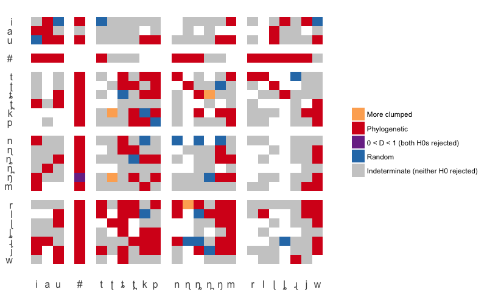
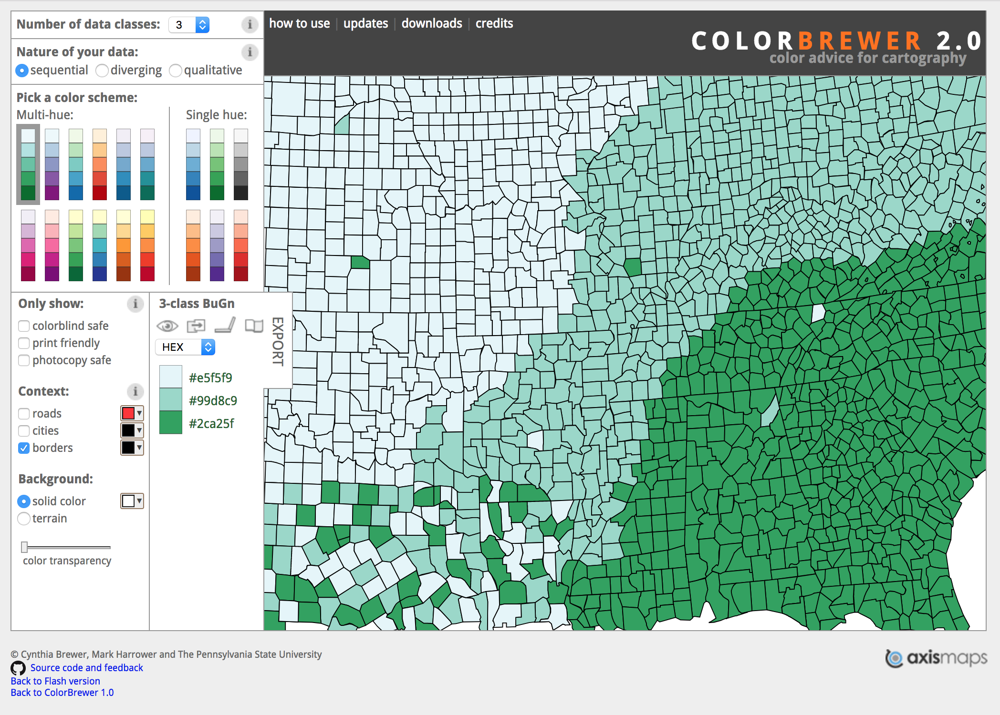
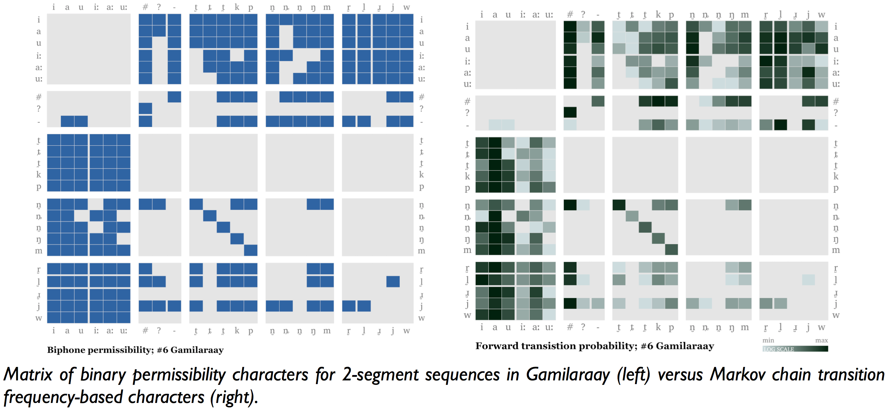

```{r setup, include=FALSE}
library(knitr)
options(htmltools.dir.version = FALSE)
```

# Background

- Macklin-Cordes, J.L., Round, E. R. & C. Bowern, _Phylogenetic independence in linguistics, and phylogenetic signal in phonotactics_ (submitted) <br/><br/>
--

- Will be published with code and data available <br/><br/>
--

- All analysis, visualisation and even write-up was conducted in R (with help of Rstudio, Rmarkdown and the ggplot2 package for viz) <br/><br/>

???

This visualisation comes from a paper which a couple of colleagues and I have submitted for publication. With some luck, it'll be published soon with full code and data available. I won't go into much detail right now, but if anyone is really interested, send me an email and I might be able to privately share the draft text or at least tell you a bit more about it.

Everything in this paper was done in R. Basically the whole pipeline happened inside my Rstudio console. I even wrote the paper in Rmarkdown (happy to discuss that experience with anyone who's interested). For visualisations, we used the ggplot2 package. The idea of ggplot is that it gives you a particular system for creating graphics, based on the book _The Grammar of Graphics_ by Leland Wilkinson.

---

# The research question

- Detecting historical signal in phonotactics <br/><br/><br/><br/>
--

- Why phonotactics? <br/><br/>
  - Easy to obtain (semi-)automatically from wordlists<br/><br/>
  - Historically conservative<br/><br/>

???

I'm not going to talk about the actual research too much, I'll just focus on the visualisation, but just to give a tiny bit of background so that it makes sense: In this study we were interested in the question of what historical signal might be lurking in phonotactics.

We were interested in phonotactics for two reasons: One was that if you have a decent enough wordlist, it's possible to extract out a lot of phonotactic information automatically (or at least semi-automatically), without the need for detailed grammars or a lot of hard labour. So it's relatively easy to obtain---low-hanging fruit. The second reason is that even as a language borrows words from neighbouring languages, often the borrowings are modified to suit local phonotactic restrictions, so phonotactics can be quite historically conservative.

---

# The research question

Data:

- Pama-Nyungan language wordlists<br/><br/>
- Coded presence/absence of two-segment sequences in each wordlist<br/><br/>
- Also coded relative frequencies<br/><br/>

--

Test:

- Several statistics to quantify _phylogenetic signal_<br/><br/>
- Takes a tree of languages for reference<br/><br/>
- Quantifies how well the data fits the tree<br/><br/>
  - (if it evolved along the tree according to a specific model)

???

So our data comes from the Pama-Nyungan family. We used about 120 wordlists, mostly from Claire Bowern's CHIRLA database.

Then we extracted out binary variables. Basically we took every logically possible sequence of two segments and then coded whether or not that sequence is ever present in a language's wordlist or not. So this is a really, really basic, kind of dumb representation of a language's phonotactic system. But it gives us a huge heap of data to play with and, like I said, it's extracted relatively quickly from a pretty basic level of language documentation.

Then we tested the strength of what's called _phylogenetic signal_. So we took an independent tree of the Pama-Nyungan family that has been made independently beforehand using more standard cognate data. Then we used a few different statistics to quantify how well our data fit that tree, given some assumptions about the evolutionary model.

---

# The _D_ statistic

--
- _D_ = 1 = randomly dispersed with respect to phylogeny<br/><br/>
- _D_ = 0 = phylogenetic signal<br/><br/>
--

- _D_ > 1 = over-dispersed with respect to phylogeny<br/><br/>
- _D_ < 0 = over-clumped with respect to phylogeny<br/><br/>

???

I'm definitely not going to get all statistical on you, but I'll just really quickly explain the output that the _D_ test we use returns to us.

So basically we have this huge set of possible two-segment sequences and a bunch of 1s and 0s, each marking whether that sequence is present or not in a particular language, and we want to know whether the patterns of 1s and 0s contain phylogenetic signal. Do the 1s and 0s tend to clump together in the tree such that related languages tend to look the same, or are they just scattered randomly with phylogenetic relationships having no bearing?

So, for each sequence, we run a test that gives a _D_ statistic. _D_ is kind of like a measure of clumpyness. A _D_ score of 1 means all the 1s and 0s are scattered randomly all over the tree. A _D_ score of 0 means the 1s and 0s clump together in a phylogenetic way---in other words, you have phylogenetic signal.

Then to keep things complicated, you can also get really high _D_ scores where the data is over-dispersed. In other words, you get a pattern of 1,0 1,0 1,0 between sister languages, to an extent that's weird even under a random process. And you can also get _D_ scores below zero, where all the 1s and 0s clump together even more than you'd expect given then tree.

---

# The _D_ statistic

Possible outcomes:
--

- Over-dispersed (D > 1)<br/><br/>
--

- Random (D near 1)<br/><br/>
--

- 0 < D < 1<br/><br/>
--

- Phylogenetic signal (D near 0)<br/><br/>
--

- Over-clumped (D < 0)<br/><br/>


???

The _D_ statistic isn't super interesting just by itself. What's more interesting are the p values that tell you the significance of that statistic. We actually get two p values with this test. One for each of the null hypotheses that D=0 and D=1. Now this can do my head in a bit but bear with me. Basically what this boils down to is that there are 6 possible outcomes, when you consider the D statistic and its two accompanying p values. The variable can be:

Significantly more dispersed (D significantly above 1)

Random (D not signficantly different from 1 but significantly above 0)

In the middle (D is somewhere between 0 and 1 but both p values are below .05, so we have to reject both the randomness and phylogenetic signal hypotheses)

Significant phylogenetic signal (D not significantly different from 0 but significantly above 1)

Significantly more clumped (D significantly below 0)

And finally, indeterminate, where both p values are high, neither null hypothesis can be rejected, it might be random or it might be phylogenetic, we can't tell.

---

# The visualisation problem

- 415 test outcomes<br/><br/>
- Interest in general patterns overall, not individual test results<br/><br/>

???

So at this point is that we had 415 D tests that we'd run on 415 variables, with 830 p values between them. And the thing is, we aren't actually that interested in any one of those 415 test outcomes. We're really more interested in general patterns overall. We don't really care whether a particular random sequence of two segments has phylogenetic signal in it, we're more interested in whether the phonotactic system overall has phylogenetic signal in it and how phylogenetic signal might pattern throughout that system.

So how did we visualise all these test results?

---

class: inverse, center

# The moment you've been waiting for

???

Drum roll please.

---

class: center

```{r d-sig-swatch, echo=FALSE, out.width='75%', fig.cap="Phylogenetic signal significance testing for binary biphone characters. This grid colour-codes each biphone character according to the results of its respective significance tests. Besides a tendency for phonotactic restrictions at word boundaries to show phylogenetic signal, few patterns stand out."}

```

???

So this is showing you all 415 test results. Each two-segment sequence is represented as a block in the grid, the first segment in the sequence on the left and second segment on the bottom. Some of them are white which is where we didn't run a D test, either because every language had the same value (either every language allows the sequence or no language does) or there weren't enough languages with one of the two segments in their phonemic inventory in the first place.

Red is the good stuff, where we found significant phylogenetic singal. Blue is random and grey is where there wasn't a significant result either way. As you can see, those are the main colours that stand out.

Another feature you'll notice is that the order of the segments isn't random but rather we've grouped things by manners of articulation. It would have been interesting if there were patterns here, particular sound classes with strong phylogenetic signal or something. But there's not too much patterning that I can see, which I find interesting in itself.

The overall result, as you can see, is that there's a bit of phylognetic signal floating around, but also a lot of indeterminate results. And that's not really unexpected when you consider how basic and coarse-grained our whole model of "phonotactics" was. Things actually get more interesting when you consider frequencies, but you'll have to check out the paper for that.

---

class: center

[colorbrewer2.org](http://colorbrewer2.org/)

```{r color-brewer, echo=FALSE, out.width='75%'}

```

---

# Code

```{r d-sig-swatch-code, echo=TRUE, eval=FALSE}
# Gather D test results
d_results <- dplyr::select(d_test_table, value = result)
d_results[,2:3] <- colsplit(d_test_table$biphone, "_", names = c("phone1", "phone2"))
d_results_matrix <- as.data.frame(spread(d_results, phone2, value))
rownames(d_results_matrix) <- d_results_matrix$phone1
d_results_matrix <- d_results_matrix[,-1]

# Get data df into shape
  df <- as.data.frame(d_results_matrix)
  df$phone1 <- rownames(df)
  df <- gather(df, phone2, value, -phone1)
  df$value <- as.factor(df$value)
  df$value <- factor(df$value, levels(df$value)[c(3,4,1,5,2)])

  # Establish the phones & order to plot
  phones1 <- unique(df$phone1)
  phones2 <- unique(df$phone2)
  phones <- union(phones1, phones2)

  order <- ausphon_IPA_order
  is_break <- str_to_lower(order) == "break"
  order[is_break] <- ""

  plot_length1 <- sum(is_break) + length(phones1)
  plot_length2 <- sum(is_break) + length(phones2)
  order1 <- order[order %in% c("", phones1)]
  order2 <- order[order %in% c("", phones2)]
  df$phone1_order <- match(df$phone1, order1)
  df$phone2_order <- match(df$phone2, order2)
```

???

So unless anyone's super interested maybe I won't go through the details of the code for this particular visualisation. I can certainly share it and share any tips if anyone uses R and is interested. Just briefly though, you can kind of see the whole Grammar of Graphics design principles reflected in the GGplot code.

At the start here, this is reading a table of test results I prepared earlier. I had to do some awkward reshaping to get it from a list of test results to the whole matrix shape, splitting the list of two segments sequences and so on.

I manually defined the colours which is a bit awkward, but they were taken from a palette in R Colour Brewer (or at least inspired by a palette there, I think I tweaked it a bit)

And then finally here, creating the ggplot object, here's mapping some aesthetics to values in the data frame.

This is perhaps all a bit awkward and hacky. It's not quite like the normal use case where you'd have some data in a nice, clean form according to tidy data principles, and it's a bit of an odd ggplot call. But it's a hacky visualisation to begin with.

---

```{r d-sig-swatch-code-2, echo=TRUE, eval=FALSE}
  cols <- c("More clumped" = "#fdae61",
            "Phylogenetic" = "#d7191c",
            "0 < D < 1 (both H0s rejected)" = "#7b3294",
            "Random" = "#2c7bb6",
            "More dispersed" = "#abd9e9",
            "Indeterminate (neither H0 rejected)" = "grey80")

  # Plot
  ggplot() +
    scale_x_continuous(breaks = 1:plot_length2 - 0.5,
                       labels = order2) +
    scale_y_continuous(breaks = -(1:plot_length1 - 0.5),
                       labels = order1) +
    geom_rect(data = df,
              mapping = aes(xmin = phone2_order - 1,
                            xmax = phone2_order,
                            ymax = -(phone1_order - 1),
                            ymin = -(phone1_order),
                            fill = value
              )
    ) +
    scale_fill_manual(values = cols,
                     breaks = c("More clumped",
                                "Phylogenetic",
                                "0 < D < 1 (both H0s rejected)",
                                "Random",
                                "Indeterminate (neither H0 rejected)"),
                     guide = guide_legend(title = NULL)
    ) +
    theme_minimal() +
    theme(panel.grid = element_blank(),
          axis.title = element_blank(),
          axis.text = element_text(family = "Arial",
                                   size = 12),
          plot.margin = margin(.2, .2, .2, .2, "cm"))
```

---
class: center

# One cool spin-off

```{r bigram-swatches, echo=FALSE, out.width='100%'}

```

???

We actually found this grid format to be useful not only with the phylogenetic signal tests, but just when inspecting data for individual languages. We actually found this pretty useful in the data tidying phase because you can look out for stray blocks of colour that might indicate, say, a random English word that snuck into the wordlist or a misspelling or something like that.

This particular figure is based on old data so you might even start noticing weird stuff right here.

---
class: inverse

# Thanks!
